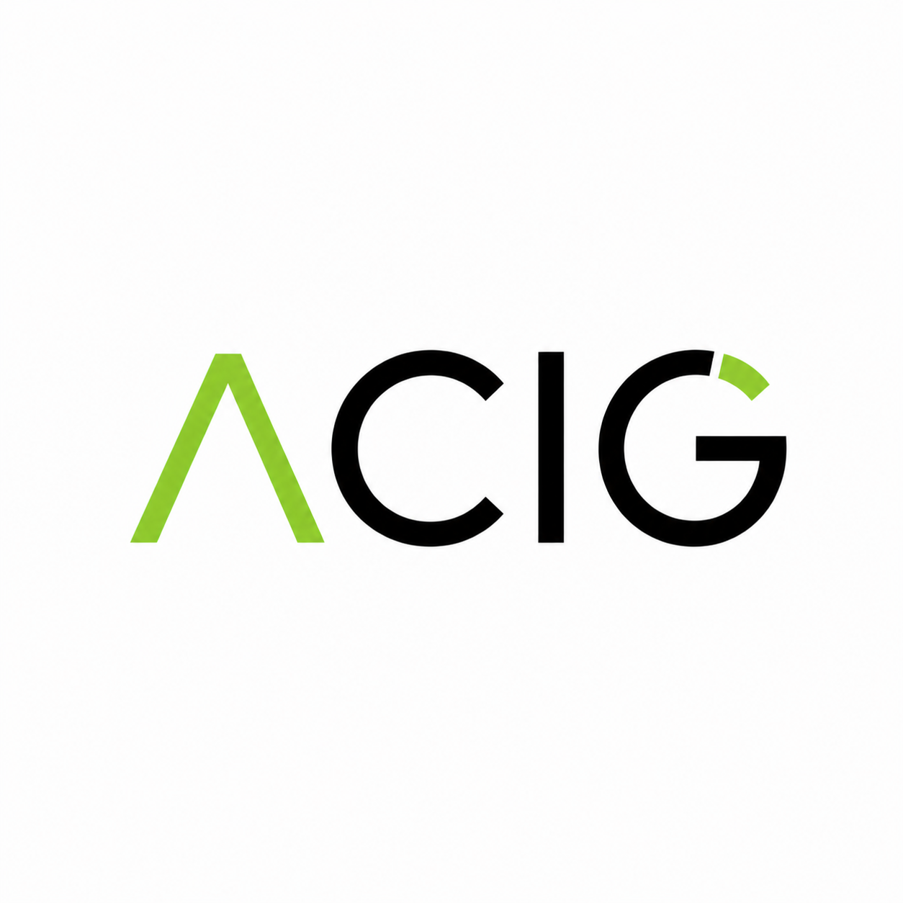

# acig — Agentic CI Gateway

<p align="center"></p>

**Tiered code review via cheap critics + frontier adjudication.** `acig` sits in front of normal CI, fanning out lightweight "critic" models in parallel and escalating to a frontier model only when needed. It emits a machine-readable JSON verdict that coding agents (and humans) can consume.

---

## Quick Start

### 1. Install

```bash
# macOS / Linux (arm64)
curl -sSL https://github.com/helloodokai/acig/releases/latest/download/acig_darwin_arm64.tar.gz \
  | tar -xz -C /usr/local/bin acig

# Linux (amd64)
curl -sSL https://github.com/helloodokai/acig/releases/latest/download/acig_linux_amd64.tar.gz \
  | tar -xz -C /usr/local/bin acig

# Homebrew
brew tap helloodokai/tap
brew install acig

# Or build from source:
git clone https://github.com/helloodokai/acig.git
cd acig && make build && cp dist/acig /usr/local/bin/
```

### 2. Set your API key

```bash
export OLLAMA_API_KEY="your-key-here"
```

Get a key at [ollama.com/settings/keys](https://ollama.com/settings/keys). Ollama Cloud runs open-weight models (`gpt-oss:20b`, `qwen3-coder:480b`) at a fraction of frontier-API prices — no local GPU needed.

### 3. Run it

```bash
cd your-repo
acig run --profile cloud           # auto-detects diff vs upstream
acig run --diff HEAD~3..HEAD       # specific range
acig run --pr 42                   # review a GitHub PR by number or URL
acig fix --profile cloud           # auto-fix findings and create a PR
acig doctor                         # check your setup
```

Output is JSON by default. Use `--format md` for a readable summary, or `--format both --out review` to write `review.json` and `review.md`.

### Exit codes

| Code | Meaning |
|------|---------|
| 0 | `pass` — no issues |
| 1 | `warn` — findings but none blocking |
| 2 | `block` — blocking findings present |
| ≥10 | Tool error (config, network, etc.) |

---

## Local Use — Pre-Push Hook

Install a git hook that runs acig before every push:

```bash
acig install-hook
```

This writes `.git/hooks/pre-push` that:
- Runs `acig run --format md --profile cloud` on the commits about to be pushed
- Blocks the push if the verdict is `block`
- Respects `ACIG_SKIP=1` env var to bypass (with a logged warning)

**If you already have a pre-push hook**, add this snippet to it:

```bash
# Run acig pre-push check
if [ "$ACIG_SKIP" != "1" ]; then
  acig run --format md --profile cloud
  ACIG_EXIT=$?
  if [ $ACIG_EXIT -eq 2 ]; then
    echo "acig: BLOCKED — push rejected. Fix issues or set ACIG_SKIP=1."
    exit 1
  fi
fi
```

---

## GitHub Actions Integration

Add this workflow to your repo at `.github/workflows/acig.yml`:

```yaml
name: Acig

on:
  pull_request:

jobs:
  acig:
    runs-on: ubuntu-latest
    permissions:
      contents: read
      pull-requests: write
      checks: write
    steps:
      - uses: actions/checkout@v4
        with:
          fetch-depth: 0
      - name: Install acig
        run: |
          curl -sSL https://github.com/helloodokai/acig/releases/latest/download/acig_linux_amd64.tar.gz \
            | tar -xz -C /usr/local/bin acig
      - name: Run acig
        env:
          OLLAMA_API_KEY: ${{ secrets.OLLAMA_API_KEY }}
          ANTHROPIC_API_KEY: ${{ secrets.ANTHROPIC_API_KEY }}
          GITHUB_TOKEN: ${{ secrets.GITHUB_TOKEN }}
        run: |
          charter_conformance="${CHARTER_PATH:-}"
          if [ -n "$charter_conformance" ]; then
            CHARTER_FLAGS="--charter $charter_conformance"
          fi
          acig run --format both --out acig-verdict --profile cloud $CHARTER_FLAGS
      - uses: actions/upload-artifact@v4
        with:
          name: acig-verdict
          path: acig-verdict.json
```

**Add these secrets to your repo** (Settings → Secrets and variables → Actions):

| Secret | Required | Description |
|--------|----------|-------------|
| `OLLAMA_API_KEY` | **Yes** | Get one at [ollama.com/settings/keys](https://ollama.com/settings/keys) |
| `ANTHROPIC_API_KEY` | No | For frontier adjudicator on high-risk diffs |
| `GITHUB_TOKEN` | Auto | Needs `pull-requests: write` and `checks: write` permissions |

`acig` posts a **sticky PR comment** (updated on each push) with a markdown summary and a collapsible JSON block, plus a **check run** named `acig`.

---

## Commands

| Command | Description |
|---------|-------------|
| `acig run` | Run the critic pipeline on a diff |
| `acig fix` | Auto-fix findings and create a PR |
| `acig install-hook` | Install the acig pre-push hook |
| `acig explain <verdict.json>` | Pretty-print a verdict for humans |
| `acig doctor` | Check that backends are reachable and API keys are set |
| `acig schema` | Print the Verdict JSON schema |

### `acig run` flags

| Flag | Default | Description |
|------|---------|-------------|
| `--diff` | auto-detect | Git diff range (e.g. `HEAD~3..HEAD`) |
| `--pr` | — | GitHub PR number or URL to review |
| `--config` | `.acig.toml` | Config file path |
| `--format` | `json` | Output format: `json`, `md`, `both` |
| `--out` | stdout | Output file base path (extensions added automatically) |
| `--budget` | from config | Per-run budget in USD |
| `--profile` | from config | `cloud` or `local` |
| `--charter` | — | Path to charter.yaml for conformance checking |

### `acig fix` flags

| Flag | Default | Description |
|------|---------|-------------|
| `--diff` | auto-detect | Git diff range (e.g. `HEAD~3..HEAD`) |
| `--pr` | — | GitHub PR number or URL to fix |
| `--config` | `.acig.toml` | Config file path |
| `--budget` | from config | Per-run budget in USD |
| `--profile` | from config | `cloud` or `local` |
| `--dry-run` | false | Show patches without applying |
| `--no-push` | false | Apply fixes but don't push or create PR |
| `--max-iterations` | 10 | Maximum number of fix iterations |
| `--branch-prefix` | `acig-fix` | Prefix for the fix branch name |

### Reviewing a PR (`--pr`)

Point acig at any GitHub PR without checking out the branch:

```bash
acig run --pr 42                          # by PR number
acig run --pr https://github.com/owner/repo/pull/42  # by URL
acig fix --pr 42 --dry-run                # preview fixes for a PR
```

Requires `gh` CLI with repo access.

### Auto-Fix (`acig fix`)

`acig fix` runs the critic pipeline, then uses the frontier model to generate unified diffs that address each finding. It creates one commit per file, pushes a branch, and opens a PR with `gh`:

```bash
# Auto-fix all findings on current branch, push and create PR
acig fix --profile cloud

# Dry-run: show patches without applying
acig fix --dry-run

# Fix specific range without pushing
acig fix --diff HEAD~3..HEAD --no-push
```

Each commit message references the finding titles (e.g. `fix(acig): missing error handling, SQL injection in auth`). The PR body includes a table of all fixes with per-file status.

---

## Configuration (`.acig.toml`)

Create `.acig.toml` in your repo root. Everything has sensible defaults — it works without one.

```toml
[budget]
per_run_usd = 0.25

[models]
default_profile   = "cloud"
fallback_to_local = true

[models.profiles.cloud]
cheap    = { provider = "ollama_cloud", name = "gpt-oss:20b" }
mid      = { provider = "ollama_cloud", name = "qwen3-coder:480b" }
frontier = { provider = "ollama_cloud", name = "glm-5.1" }

[models.profiles.local]
cheap    = { provider = "ollama_local", name = "qwen2.5-coder:7b",  host = "http://localhost:11434" }
mid      = { provider = "ollama_local", name = "qwen2.5-coder:32b", host = "http://localhost:11434" }
frontier = { provider = "ollama_local", name = "qwen2.5-coder:32b", host = "http://localhost:11434" }

[models.ollama_cloud]
host    = "https://ollama.com"
api_key = "${OLLAMA_API_KEY}"

[models.openai]
api_key = "${OPENAI_API_KEY}"

[models.anthropic]
api_key = "${ANTHROPIC_API_KEY}"

[critics]
enabled = ["risk_classifier", "style_conformance", "test_coverage_smell", "security_smell", "perf_smell"]

[critics.adjudicator]
trigger_on = ["risk:high", "risk:critical", "conflict"]

[paths]
critical = ["src/auth/**", "src/payments/**", "migrations/**"]

[charter]
path = ".charters/ch-2026-05-04-abc123.yaml"   # optional: path to a charter file for conformance checking
auto = true                                      # optional: auto-detect from PR body "Charter:" trailer
```

**Key options:**
- `budget.per_run_usd` — maximum spend per `acig run` invocation (default: $0.25)
- `models.default_profile` — `cloud` or `local`
- `models.fallback_to_local` — if Ollama Cloud fails, fall back to local Ollama
- `critics.enabled` — which critics to run (add `charter_conformance` when using charters)
- `critics.adjudicator.trigger_on` — when to run the frontier adjudicator
- `charter.path` — path to a charter.yaml for conformance checking
- `charter.auto` — auto-detect charter from PR body `Charter:` trailer
- `paths.critical` — glob patterns; changes here auto-bump risk to `high`

### Ollama Cloud as frontier

Ollama Cloud hosts large models that work well as frontier adjudicators and fix generators — often cheaper than OpenAI/Anthropic:

```toml
[models.profiles.cloud]
frontier = { provider = "ollama_cloud", name = "glm-5.1" }
# or:    frontier = { provider = "ollama_cloud", name = "kimi-k2.6" }
# or:    frontier = { provider = "ollama_cloud", name = "minimax-m2.7" }
```

You can mix providers: Ollama Cloud for cheap/mid, OpenAI for frontier, or vice versa.

### API keys

All provider keys can be set in `.acig.toml` or via environment variables. Config values support `${VAR}` interpolation:

```toml
[models.openai]
api_key = "${OPENAI_API_KEY}"      # reads from env var

[models.anthropic]
api_key = "sk-ant-..."              # or paste directly (add .acig.toml to .gitignore!)

[models.ollama_cloud]
api_key = "${OLLAMA_API_KEY}"       # env var interpolation
```

**Add `.acig.toml` to `.gitignore`** if you put real keys in it — or use `${VAR}` interpolation to keep secrets out of the file.

---

## Critics

| Critic | Tier | What it checks |
|--------|------|----------------|
| `risk_classifier` | cheap | Overall risk (runs first; gates other critics) |
| `style_conformance` | cheap | Naming, formatting, docs, dead code, magic numbers |
| `test_coverage_smell` | cheap | Missing tests for new logic, untested error paths |
| `security_smell` | mid | SQL injection, XSS, hardcoded secrets, auth issues |
| `perf_smell` | mid | N+1 queries, unbounded allocations, missing timeouts |
| `charter_conformance` | cheap | Checks diff against a charter.yaml (optional, requires `charter`) |
| `adjudicator` | frontier | Resolves conflicts between critics; adds missed findings |

The **risk_classifier** always runs first and synchronously. Its output determines which other critics are needed. Low-risk diffs skip the expensive adjudicator entirely.

---

## Verdict JSON Schema

Run `acig schema` to output the full JSON schema. The verdict always includes:

```json
{
  "schema_version": "1",
  "repo": "github.com/owner/repo",
  "sha": "abc123...",
  "base_sha": "def456...",
  "risk": "low|medium|high|critical",
  "decision": "pass|warn|block",
  "summary": "Decision: pass | Risk: low | Findings: 0 blocking, 0 high, ...",
  "findings": [...],
  "critic_results": [...],
  "total_cost_usd": 0.0042,
  "total_duration_ms": 3200,
  "budget_remaining_usd": 0.2458,
  "generated_at": "2025-01-15T10:30:00Z"
}
```

The schema is stable across versions. Use it to validate automated consumers.

---

## Charter Integration

[CHARTER](https://github.com/helloodokai/charter) is acig's upstream companion — it hardens intent **before** an agent starts work, producing a `charter.yaml` contract. Acig's `charter_conformance` critic checks that the diff actually implements what the charter specifies.

### Setup

1. Install charter alongside acig:

```bash
brew tap helloodokai/charter-tap
brew install charter
```

2. Reference a charter in your acig run:

```bash
acig run --charter .charters/ch-2026-05-04-abc123.yaml
```

Or set it in `.acig.toml`:

```toml
[charter]
path = ".charters/ch-2026-05-04-abc123.yaml"
```

3. Or add a `Charter:` trailer to your PR body:

```
Charter: .charters/ch-2026-05-04-abc123.yaml
```

### What it checks

When a charter is referenced, the `charter_conformance` critic runs `charter conformance` against the diff and surfaces findings for:

- **Blast radius violations** — files changed outside the charter's declared scope
- **Non-goal violations** — changes touching areas the charter explicitly excluded
- **Blocking unknowns** — unresolved blocking questions that prevent merge
- **Acceptance criteria gaps** — criteria the diff doesn't address

Findings are merged into the acig verdict like any other critic output, so they influence the final decision and risk level.

### When there's no charter

The `charter_conformance` critic is **opt-in only**. If no charter is referenced (no `--charter` flag, no `[charter]` config, no `Charter:` trailer), the critic silently skips. Charter is not required for acig to work — it's an enhancement for teams that want stronger spec enforcement.

---

## For AI Agents Consuming This Output

If you are a coding agent reading this, here's what you need:

1. **Read the verdict JSON.** It's the single source of truth. Find the `acig-verdict.json` artifact or look for the `<details>` block in the PR comment.
2. **`decision` tells you the gate.** `"pass"` → you're done. `"warn"` → optional fixes. `"block"` → you must address findings before merge.
3. **Each `finding` has a `severity`, `file`, `line_start`, and `suggested_fix`.** Use these to target your edits.
4. **`critic_results` shows which models ran and what they cost.** The `adjudicator` critic is authoritative when present.
5. **Validate against the schema** (`acig schema`) before relying on fields. New fields may be added; existing fields will not be removed or renamed within a `schema_version`.
6. **Budget is tracked.** If `budget_remaining_usd <= 0`, some critics were skipped. Re-run with a higher budget if needed.

---

## Cost & Latency Reality Check

Approximate cost and latency on a representative ~200-line diff (5 files changed):

| Tier | Provider | Model | Cost | Latency |
|------|----------|-------|------|---------|
| cheap | Ollama Cloud | `gpt-oss:20b` | ~$0.001 | 1-5s |
| mid | Ollama Cloud | `qwen3-coder:480b` | ~$0.005 | 2-6s |
| frontier | Ollama Cloud | `glm-5.1` | ~$0.01 | 3-8s |
| frontier | OpenAI | `gpt-5-nano` | ~$0.05 | 1-3s |
| cheap | Local Ollama | `qwen2.5-coder:7b` | $0 | 1-4s |
| mid | Local Ollama | `qwen2.5-coder:32b` | $0 | 3-8s |
| | **Full pipeline (cloud)** | | **~$0.002** | **10-50s** |
| | **Full pipeline (local)** | | **$0** | **8-30s** |

*Latency varies by diff size, network, and model load. These are observed averages.*

A full cloud run on a typical diff costs well under $0.01 — ~40x cheaper than running a single frontier model on the same input.

---

## How It Works

```
┌─────────────┐                                    ┌─────────────┐
│  acig run   │                                    │  acig fix    │
└─────┬───────┘                                    └─────┬───────┘
      │                                                  │
      ▼                                                  ▼
┌──────────────────┐     cheap tier              ┌─────────────────┐
│  risk_classifier │◄──────────── Ollama Cloud  │  Run pipeline    │
└─────┬────────────┘                           │  (same as run)   │
      │ risk = low/medium/high/critical         └────────┬────────┘
      ▼                                                   │
┌──────────────────────────────────────────────┐          │
│                 Fan-out (4 concurrent)       │          ▼
│                                              │   ┌─────────────────┐
│  style  ─────────► cheap  ──► Cloud          │   │  Group findings │
│  tests  ─────────► cheap  ──► Cloud          │   │  by file        │
│  security ───────► mid    ──► Cloud          │   └────────┬────────┘
│  perf   ─────────► mid    ──► Cloud          │            │
└──────────────────────┬───────────────────────┘            ▼
                       │                          ┌─────────────────┐
                       ▼                          │  Frontier model  │
              ┌────────────────┐                 │  generates diff │
              │  adjudicator   │◄── frontier ──► │  per file      │
              └────────────────┘                 └────────┬────────┘
                       │                                   │
                       ▼                                   ▼
              ┌────────────────┐                 ┌─────────────────┐
              │  Verdict JSON  │──► stdout/file   │  git apply +    │
              └────────────────┘   / GitHub       │  commit + PR    │
                                                   └─────────────────┘
```

---

## Building from Source

```bash
git clone https://github.com/helloodokai/acig.git
cd acig
make build              # builds to dist/acig
make test               # runs tests
make lint               # golangci-lint
make release-snapshot   # goreleaser snapshot
```

Requires Go 1.24+, golangci-lint, and goreleaser.

## License

MIT