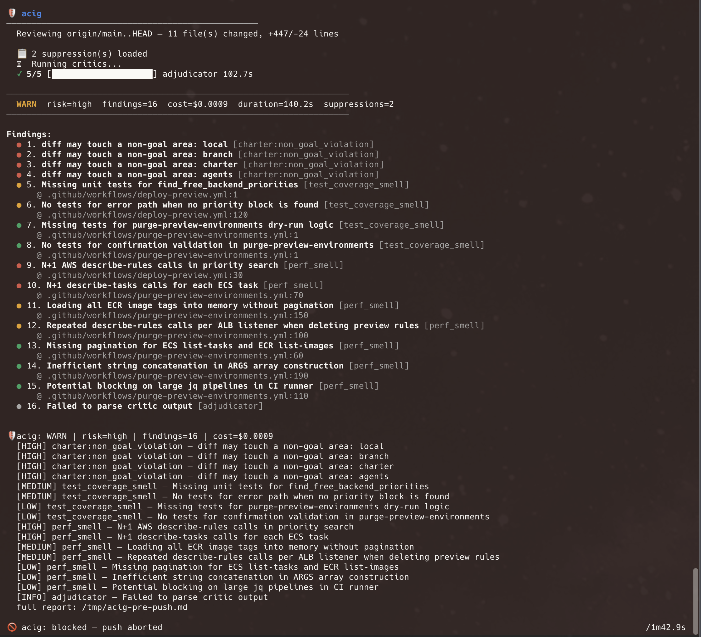

# acig — Agentic CI Gateway

<p align="center"></p>

**Tiered code review via cheap critics + frontier adjudication.** `acig` sits in front of normal CI, fanning out lightweight "critic" models in parallel and escalating to a frontier model only when needed. It emits a machine-readable JSON verdict that coding agents (and humans) can consume.

<p align="center"></p>

---

## Quick Start

### 1. Install

```bash
# macOS (Homebrew — recommended)
brew tap helloodokai/tap
brew install acig

# macOS / Linux (manual)
VERSION="1.4.1"
curl -sL "https://github.com/helloodokai/acig/releases/download/v${VERSION}/checksums.txt" -o /tmp/checksums.txt
curl -sL "https://github.com/helloodokai/acig/releases/download/v${VERSION}/acig_darwin_arm64.tar.gz" -o /tmp/acig.tar.gz
EXPECTED=$(grep acig_darwin_arm64.tar.gz /tmp/checksums.txt | awk '{print $1}')
ACTUAL=$(sha256sum /tmp/acig.tar.gz | awk '{print $1}')
[ "$EXPECTED" = "$ACTUAL" ] || { echo "checksum mismatch"; exit 1; }
tar xzf /tmp/acig.tar.gz -C /usr/local/bin acig

# Linux (amd64) — same pattern, swap acig_linux_amd64.tar.gz
```

### 2. Set your API key

```bash
export OLLAMA_API_KEY="your-key-here"
```

Get a key at [ollama.com/settings/keys](https://ollama.com/settings/keys). Ollama Cloud runs open-weight models (`gpt-oss:20b`, `qwen3-coder:480b`) at a fraction of frontier-API prices — no local GPU needed.

### 3. Run it

```bash
cd your-repo
acig run --profile cloud           # auto-detects diff vs upstream
acig run --diff HEAD~3..HEAD       # specific range
acig run --pr 42                   # review a GitHub PR by number or URL
acig fix --profile cloud           # auto-fix findings and create a PR
acig doctor                         # check your setup
```

Output is JSON by default. Use `--format md` for a readable summary, or `--format both --out review` to write `review.json` and `review.md`.

### Exit codes

| Code | Meaning |
|------|---------|
| 0 | `pass`, `warn`, or `block` with `[blocking] enabled = false` |
| 2 | `warn` or `block` with `[blocking] enabled = true` (default) |
| ≥10 | Tool error (config, network, etc.) |

By default, acig blocks on `warn` and `block` verdicts (exit 2). Set `[blocking] enabled = false` to make all verdicts non-blocking (exit 0). See [Blocking mode](#blocking-mode).

---

## Interactive UI

When running in a terminal, acig shows a live progress UI:

```
🛡️  acig
──────────────────────────────────────────────────
  Reviewing origin/main..HEAD — 8 file(s) changed, +426/-11 lines

  ⏳ Running critics...
  ✓ 6/6 [████████████████████] security_smell 13.7s

──────────────────────────────────────────────────
  PASS   risk=low  findings=0  cost=$0.0006  duration=13.8s
──────────────────────────────────────────────────

  ✓ No findings. Code looks clean.
```

In CI (`GITHUB_ACTIONS=true`) or with `NO_COLOR=1`, acig falls back to structured `slog` JSON output for machine parsing.

---

## Local Use — Pre-Push Hook

Install a git hook that runs acig before every push:

```bash
acig install-hook
```

This writes `.git/hooks/pre-push` that runs acig and blocks the push on `block` verdicts. Example hook:

```bash
ACIG="/opt/homebrew/bin/acig"

"$ACIG" run --profile cloud --format md --diff "origin/main..HEAD" --out /tmp/acig-pre-push
ACIG_EXIT=$?
if [ $ACIG_EXIT -eq 2 ]; then
  echo "🚫 acig: blocked — push aborted"
  exit 1
elif [ $ACIG_EXIT -eq 1 ]; then
  echo "⚠️  acig: warnings found"
fi
```

---

## GitHub Actions Integration

### GitHub App Setup (Recommended)

Without a GitHub App, acig reviews appear as `github-actions[bot]`. To show reviews with the **ACIG** name and logo:

1. **Create the app** — run `acig setup-app` to configure secrets interactively, or create one manually at [GitHub Developer Settings](https://github.com/settings/apps/new) with:
   - **Permissions**: Pull requests: Read & write, Checks: Read & write, Contents: Read-only
   - **Events**: Pull request, Pull request review, Check run, Check suite
   - Leave webhook URL and callback URL empty (not needed for CI-only apps)
   - Upload the ACIG logo as the app icon
2. **Generate a private key** — in the app settings → General → Private keys → Generate private key → download the `.pem` file
3. **Install the app** on your repository — Settings → Install App → select repos
4. **Add repository secrets** (Settings → Secrets and variables → Actions):
   - `ACIG_APP_ID` — your App ID (shown on the app settings page)
   - `ACIG_APP_PRIVATE_KEY` — the full contents of the `.pem` file (not the file path)

### Workflow

Add this workflow to `.github/workflows/acig.yml`:

```yaml
name: acig

on:
  pull_request:
    types: [opened, synchronize, reopened]

concurrency:
  group: acig-${{ github.event.pull_request.number }}
  cancel-in-progress: true

permissions:
  contents: read
  pull-requests: write
  checks: write

jobs:
  review:
    name: acig review
    runs-on: ubuntu-latest
    steps:
      - uses: actions/checkout@v4
        with:
          fetch-depth: 0

      - name: Get GitHub App token
        id: app-token
        uses: actions/create-github-app-token@v2
        if: ${{ secrets.ACIG_APP_ID != '' && secrets.ACIG_APP_PRIVATE_KEY != '' }}
        with:
          app-id: ${{ secrets.ACIG_APP_ID }}
          private-key: ${{ secrets.ACIG_APP_PRIVATE_KEY }}

      - name: Install acig
        env:
          GITHUB_TOKEN: ${{ secrets.GITHUB_TOKEN }}
        run: |
          ACIG_VERSION="1.4.1"
          RELEASE_URL="https://github.com/helloodokai/acig/releases/download/v${ACIG_VERSION}"
          
          curl -sL "${RELEASE_URL}/checksums.txt" -o /tmp/checksums.txt
          curl -sL "${RELEASE_URL}/acig_linux_amd64.tar.gz" -o /tmp/acig_linux_amd64.tar.gz
          
          cd /tmp
          EXPECTED=$(grep acig_linux_amd64.tar.gz checksums.txt | awk '{print $1}')
          ACTUAL=$(sha256sum acig_linux_amd64.tar.gz | awk '{print $1}')
          if [ "$EXPECTED" != "$ACTUAL" ]; then
            echo "::error::checksum mismatch: expected $EXPECTED got $ACTUAL"
            exit 1
          fi
          
          tar xz -f acig_linux_amd64.tar.gz -C /usr/local/bin acig
          chmod +x /usr/local/bin/acig

      - name: Run acig
        env:
          GITHUB_TOKEN: ${{ steps.app-token.outputs.token || secrets.GITHUB_TOKEN }}
          OLLAMA_API_KEY: ${{ secrets.OLLAMA_API_KEY }}
          OPENAI_API_KEY: ${{ secrets.OPENAI_API_KEY }}
          ANTHROPIC_API_KEY: ${{ secrets.ANTHROPIC_API_KEY }}
        run: |
          acig run --pr ${{ github.event.pull_request.number }} --sha ${{ github.event.pull_request.head.sha }} --format both --out /tmp/acig-review
          EXIT_CODE=$?
          if [ "$EXIT_CODE" -ge 2 ]; then
            echo "::error::acig blocked this PR"
            exit 1
          elif [ "$EXIT_CODE" -eq 1 ]; then
            echo "::warning::acig found warnings"
          else
            echo "::notice::acig passed"
          fi
```

The workflow uses `actions/create-github-app-token` when `ACIG_APP_ID` and `ACIG_APP_PRIVATE_KEY` secrets are set. If they're not set, it falls back to `GITHUB_TOKEN` (reviews appear as `github-actions[bot]`).

**Required secrets** (Settings → Secrets and variables → Actions):

| Secret | Description |
|--------|-------------|
| `ACIG_APP_ID` | **Recommended.** Your GitHub App ID (reviews show as "ACIG" with custom logo) |
| `ACIG_APP_PRIVATE_KEY` | **Recommended.** Private key from the app settings (.pem file contents) |
| `OLLAMA_API_KEY` | **Required.** Get one at [ollama.com/settings/keys](https://ollama.com/settings/keys) |
| `OPENAI_API_KEY` | Optional, for `openai/*` frontier models |
| `ANTHROPIC_API_KEY` | Optional, for `anthropic/*` frontier models |

`acig` posts a **GitHub Pull Request Review** with inline comments on the relevant lines, plus an overall review summary. On re-runs, previous acig reviews are dismissed and replaced. Block verdicts result in `REQUEST_CHANGES`; pass/warn result in `COMMENT`. A **check run** named `acig` is also created.

---

## Commands

| Command | Description |
|---------|-------------|
| `acig run` | Run the critic pipeline on a diff |
| `acig fix` | Auto-fix findings and create a PR |
| `acig suppress` | Suppress findings from future runs |
| `acig setup-app` | Create a GitHub App for ACIG reviews (one-click setup) |
| `acig install-hook` | Install the acig pre-push hook |
| `acig explain <verdict.json>` | Pretty-print a verdict for humans |
| `acig doctor` | Check backends and API keys |
| `acig schema` | Print the Verdict JSON schema |

### `acig run` flags

| Flag | Default | Description |
|------|---------|-------------|
| `--diff` | auto-detect | Git diff range (e.g. `HEAD~3..HEAD`) |
| `--pr` | — | GitHub PR number or URL to review |
| `--sha` | auto-detect | Commit SHA for check runs |
| `--config` | `.acig.toml` | Config file path |
| `--format` | `json` | Output format: `json`, `md`, `both` |
| `--out` | stdout | Output file base path (extensions added) |
| `--budget` | from config | Per-run budget in USD |
| `--profile` | from config | `cloud` or `local` |
| `--charter` | — | Path to charter.yaml for conformance checking |
| `--suppress` | `.acig-suppressions.toml` | Path to suppressions file |

### `acig fix` flags

| Flag | Default | Description |
|------|---------|-------------|
| `--diff` | auto-detect | Git diff range (e.g. `HEAD~3..HEAD`) |
| `--pr` | — | GitHub PR number or URL to fix |
| `--config` | `.acig.toml` | Config file path |
| `--budget` | from config | Per-run budget in USD |
| `--profile` | from config | `cloud` or `local` |
| `--dry-run` | false | Show patches without applying |
| `--no-push` | false | Apply fixes but don't push or create PR |
| `--max-iterations` | 10 | Maximum number of fix iterations |
| `--branch-prefix` | `acig-fix` | Prefix for the fix branch name |

### `acig suppress` — managing suppressed findings

Suppress persistent findings you've already reviewed so they don't appear in future runs:

```bash
# List findings from last run with indices
acig suppress

# Suppress specific findings by index
acig suppress 0 3 7

# Suppress all findings from last run
acig suppress --all --reason "acceptable tech debt"

# List current suppressions
acig suppress --list
```

Suppressions are stored in `.acig-suppressions.toml` (add it to `.gitignore` or commit it for team-wide suppressions):

```toml
[[suppression]]
critic = "style_conformance"
title = "Missing doc comment"
file = "internal/handler.go"
reason = "internal package, no public API"

[[suppression]]
critic = "security_smell"
title = "Hardcoded secret"
reason = "test env var"
expires = "2026-12-31"
```

Expired suppressions are automatically ignored. Matches work on `critic`, `title`, and `file` — omit a field to match broadly.

---

## Finding Deduplication

When multiple critics flag the same issue (e.g. both `risk_classifier` and `security_smell` report a hardcoded secret in the same file), acig deduplicates findings by matching on severity + file + normalized title + detail prefix. Only the first finding is kept, avoiding noise in the review.

---

## Blocking Mode

By default, acig is **blocking**: `warn` and `block` verdicts exit 2. This means CI builds and pre-push hooks fail when issues are found.

To make acig non-blocking (all verdicts exit 0), add to `.acig.toml`:

```toml
[blocking]
enabled = false
```

| Config | `pass` | `warn` | `block` |
|--------|-------|-------|---------|
| `blocking.enabled = true` (default) | exit 0 | exit 2 | exit 2 |
| `blocking.enabled = false` | exit 0 | exit 0 | exit 0 |

---

## Configuration (`.acig.toml`)

Create `.acig.toml` in your repo root. Everything has sensible defaults — it works without one.

```toml
[budget]
per_run_usd = 0.25

[models]
default_profile   = "cloud"
fallback_to_local = true

[models.profiles.cloud]
cheap    = { provider = "ollama_cloud", name = "gpt-oss:20b" }
mid      = { provider = "ollama_cloud", name = "qwen3-coder:480b" }
frontier = { provider = "ollama_cloud", name = "glm-5.1" }

[models.profiles.local]
cheap    = { provider = "ollama_local", name = "qwen2.5-coder:7b",  host = "http://localhost:11434" }
mid      = { provider = "ollama_local", name = "qwen2.5-coder:32b", host = "http://localhost:11434" }
frontier = { provider = "ollama_local", name = "qwen2.5-coder:32b", host = "http://localhost:11434" }

[models.ollama_cloud]
host    = "https://ollama.com"
api_key = "${OLLAMA_API_KEY}"

[models.openai]
api_key = "${OPENAI_API_KEY}"

[models.anthropic]
api_key = "${ANTHROPIC_API_KEY}"

[critics]
enabled = ["risk_classifier", "style_conformance", "test_coverage_smell", "security_smell", "perf_smell"]

[critics.adjudicator]
trigger_on = ["risk:high", "risk:critical", "conflict"]

[blocking]
enabled = false

[paths]
critical = ["src/auth/**", "src/payments/**", "migrations/**"]

[charter]
path = ".charters/ch-2026-05-04-abc123.yaml"   # path to a charter file (not the directory)
auto = true                                        # auto-detect from PR body "Charter:" trailer
```

**Key options:**
- `budget.per_run_usd` — maximum spend per `acig run` invocation (default: $0.25)
- `models.default_profile` — `cloud` or `local`
- `models.fallback_to_local` — if Ollama Cloud fails, fall back to local Ollama
- `critics.enabled` — which critics to run (do NOT include `charter_conformance` here; it's auto-added when `[charter]` is configured)
- `critics.adjudicator.trigger_on` — when to run the frontier adjudicator
- `blocking.enabled` — make `warn` verdict exit 2 instead of 0 (default: false)
- `charter.path` — path to a charter.yaml file for conformance checking (must be a file, not a directory)
- `charter.auto` — auto-detect charter from PR body `Charter:` trailer
- `paths.critical` — glob patterns; changes here auto-bump risk to `high`

### Ollama Cloud as frontier

Ollama Cloud hosts large models that work well as frontier adjudicators and fix generators — often cheaper than OpenAI/Anthropic:

```toml
[models.profiles.cloud]
frontier = { provider = "ollama_cloud", name = "glm-5.1" }
# or:    frontier = { provider = "ollama_cloud", name = "kimi-k2.6" }
# or:    frontier = { provider = "ollama_cloud", name = "minimax-m2.7" }
```

You can mix providers: Ollama Cloud for cheap/mid, OpenAI for frontier, or vice versa.

### API keys

All provider keys can be set in `.acig.toml` or via environment variables. Config values support `${VAR}` interpolation:

```toml
[models.openai]
api_key = "${OPENAI_API_KEY}"      # reads from env var

[models.anthropic]
api_key = "sk-ant-..."              # or paste directly (add .acig.toml to .gitignore!)

[models.ollama_cloud]
api_key = "${OLLAMA_API_KEY}"       # env var interpolation
```

**Add `.acig.toml` to `.gitignore`** if you put real keys in it — or use `${VAR}` interpolation to keep secrets out of the file.

---

## Critics

| Critic | Tier | What it checks |
|--------|------|----------------|
| `risk_classifier` | cheap | Overall risk (runs first; gates other critics) |
| `style_conformance` | cheap | Naming, formatting, docs, dead code, magic numbers |
| `test_coverage_smell` | cheap | Missing tests for new logic, untested error paths |
| `security_smell` | mid | SQL injection, XSS, hardcoded secrets, auth issues |
| `perf_smell` | mid | N+1 queries, unbounded allocations, missing timeouts |
| `charter_conformance` | cheap | Checks diff against a charter.yaml (auto-added when `[charter]` is configured) |
| `adjudicator` | frontier | Resolves conflicts between critics; adds missed findings |

All critics (including `risk_classifier`) now run **in parallel** for minimum latency. The adjudicator runs only when triggered. `charter_conformance` is auto-added by the `[charter]` config section — don't add it to `critics.enabled` or it will run twice.

---

## Verdict JSON Schema

Run `acig schema` to output the full JSON schema. The verdict always includes:

```json
{
  "schema_version": "1",
  "repo": "github.com/owner/repo",
  "sha": "abc123...",
  "base_sha": "def456...",
  "risk": "low|medium|high|critical",
  "decision": "pass|warn|block",
  "summary": "Decision: pass | Risk: low | Findings: 0 blocking, 0 high, ...",
  "findings": [...],
  "critic_results": [...],
  "total_cost_usd": 0.0042,
  "total_duration_ms": 3200,
  "budget_remaining_usd": 0.2458,
  "generated_at": "2025-01-15T10:30:00Z"
}
```

The schema is stable across versions. Use it to validate automated consumers.

---

## Charter Integration

[CHARTER](https://github.com/helloodokai/charter) is acig's upstream companion — it hardens intent **before** an agent starts work, producing a `charter.yaml` contract. Acig's `charter_conformance` critic checks that the diff actually implements what the charter specifies.

### Setup

1. Install charter alongside acig:

```bash
brew tap helloodokai/charter-tap
brew install charter
```

2. Reference a charter in your acig config:

```toml
[charter]
path = ".charters/ch-2026-05-04-abc123.yaml"   # must be a file, not a directory
auto = true
```

Or via flag: `acig run --charter .charters/ch-2026-05-04-abc123.yaml`

3. Or add a `Charter:` trailer to your PR body:

```
Charter: .charters/ch-2026-05-04-abc123.yaml
```

### Important

- `charter.path` must point to a **specific `.yaml file**, not a directory. If you set it to a directory, the charter binary will fail with `read .charters: is a directory`.
- Don't add `charter_conformance` to `critics.enabled` — it's automatically added when `[charter]` is configured. Adding it manually causes it to run twice.

---

## For AI Agents Consuming This Output

If you are a coding agent reading this, here's what you need:

1. **Read the verdict JSON.** It's the single source of truth. Find the `acig-last-verdict.json` or the `<details>` block in the PR comment.
2. **`decision` tells you the gate.** `"pass"` → you're done. `"warn"` → optional fixes (non-blocking by default). `"block"` → you must address findings before merge.
3. **Each `finding` has a `severity`, `file`, `line_start`, and `suggested_fix`.** Use these to target your edits.
4. **`critic_results` shows which models ran and what they cost.** The `adjudicator` critic is authoritative when present.
5. **Suppress false positives** with `acig suppress <index>` or `acig suppress --all --reason "why"`.
6. **Budget is tracked.** If `budget_remaining_usd <= 0`, some critics were skipped. Re-run with a higher budget if needed.
7. **Validate against the schema** (`acig schema`) before relying on fields. New fields may be added; existing fields will not be removed or renamed within a `schema_version`.

---

## Cost & Latency Reality Check

Approximate cost and latency on a representative ~200-line diff (5 files changed):

| Tier | Provider | Model | Cost | Latency |
|------|----------|-------|------|---------|
| cheap | Ollama Cloud | `gpt-oss:20b` | ~$0.001 | 1-5s |
| mid | Ollama Cloud | `qwen3-coder:480b` | ~$0.005 | 2-6s |
| frontier | Ollama Cloud | `glm-5.1` | ~$0.01 | 3-8s |
| frontier | OpenAI | `gpt-5-nano` | ~$0.05 | 1-3s |
| cheap | Local Ollama | `qwen2.5-coder:7b` | $0 | 1-4s |
| mid | Local Ollama | `qwen2.5-coder:32b` | $0 | 3-8s |
| | **Full pipeline (cloud)** | | **~$0.002** | **10-50s** |
| | **Full pipeline (local)** | | **$0** | **8-30s** |

*Latency varies by diff size, network, and model load. All critics run in parallel (concurrency 8).*

---

## How It Works

```
┌─────────────┐                                    ┌─────────────┐
│  acig run   │                                    │  acig fix    │
└─────┬───────┘                                    └─────┬───────┘
      │                                                  │
      ▼                                                  ▼
┌──────────────────┐     cheap/mid tier           ┌─────────────────┐
│  risk_classifier │◄──────────── Ollama Cloud    │  Run pipeline    │
└─────┬────────────┘                           │  (same as run)   │
      │ risk = low/medium/high/critical         └────────┬──────────┘
      ▼                                                   │
┌──────────────────────────────────────────────┐          │
│           Fan-out (8 concurrent)            │          ▼
│                                             │   ┌─────────────────┐
│  style  ─────────► cheap  ──► Cloud        │   │  Group findings │
│  tests  ─────────► cheap  ──► Cloud        │   │  by file        │
│  security ───────► mid    ──► Cloud        │   └────────┬────────┘
│  perf   ─────────► mid    ──► Cloud        │            │
│  charter ─────────► cheap  ──► Cloud        │            ▼
└──────────────────────┬───────────────────────┘   ┌─────────────────┐
                       │                             │  Frontier model  │
                       ▼                             │  generates diff │
              ┌────────────────┐                     │  per file       │
              │  adjudicator   │◄── frontier ────────► │                 │
              └────────────────┘                     └────────┬────────┘
                       │                                      │
                       ▼                                      ▼
              ┌────────────────┐                      ┌─────────────────┐
              │  Verdict JSON  │──► suppress ──► JSON   │  git apply +    │
              └────────────────┘   / GitHub           │  commit + PR    │
                                                          └─────────────────┘
```

---

## Building from Source

```bash
git clone https://github.com/helloodokai/acig.git
cd acig
go build -o /usr/local/bin/acig ./cmd/acig/main.go     # build
go test ./... -race                                       # test with race detector
```

Requires Go 1.24+.

## License

MIT